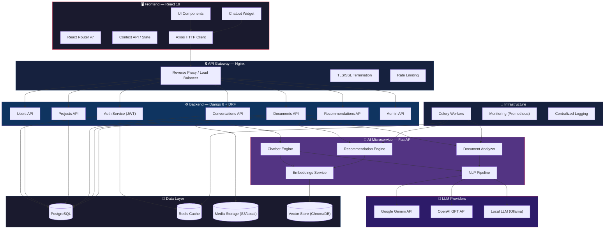
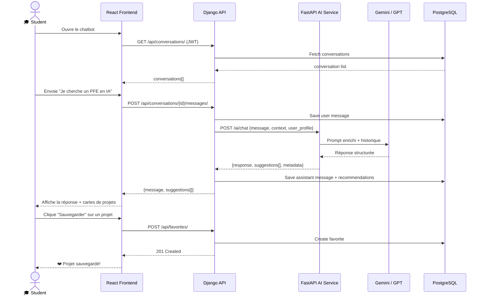

# Smart PFE Platform — Architecture Technique

## Vue d'ensemble

Plateforme web intelligente basée sur une architecture **microservices** avec séparation claire entre le Frontend (React), le Backend (Django/DRF), et le Service IA (FastAPI).

---

## Architecture Microservices

---

## Flux de Communication

---

## Stack Technique

| Couche | Technologie | Rôle |
|--------|-------------|------|
| Frontend | React 19, React Router 7, Axios, Framer Motion | Interface utilisateur SPA |
| Backend | Django 6, DRF, SimpleJWT | API REST, logique métier |
| AI Service | FastAPI, LangChain, ChromaDB | Chatbot, analyse, recommandations |
| Database | PostgreSQL 16 | Stockage relationnel |
| Cache | Redis | Sessions, cache, file de tâches |
| Task Queue | Celery | Traitement asynchrone |
| LLM | Google Gemini / OpenAI GPT | Génération de langage naturel |
| Reverse Proxy | Nginx | Load balancing, SSL |

---

## Endpoints API Principaux

| Méthode | Endpoint | Description |
|---------|----------|-------------|
| POST | `/api/auth/register/` | Inscription |
| POST | `/api/auth/login/` | Connexion (JWT) |
| POST | `/api/auth/token/refresh/` | Rafraîchir le token |
| GET | `/api/users/me/` | Profil utilisateur |
| GET/POST | `/api/projects/` | Lister / créer des projets |
| GET/POST | `/api/conversations/` | Lister / créer des conversations |
| POST | `/api/conversations/{id}/messages/` | Envoyer un message au chatbot |
| POST | `/api/documents/upload/` | Upload de fichiers |
| GET | `/api/recommendations/` | Obtenir des recommandations |
| GET | `/api/favorites/` | Projets favoris |
| GET | `/api/admin/stats/` | Statistiques admin |

---

## Sécurité

- **Authentification** : JWT (access + refresh tokens)
- **Autorisation** : Rôles `admin` / `student` avec permissions DRF
- **CORS** : Configuré pour le frontend uniquement
- **Validation** : Serializers DRF + validation côté client
- **Fichiers** : Validation MIME type + taille maximale
- **Rate Limiting** : Throttling DRF + Nginx
