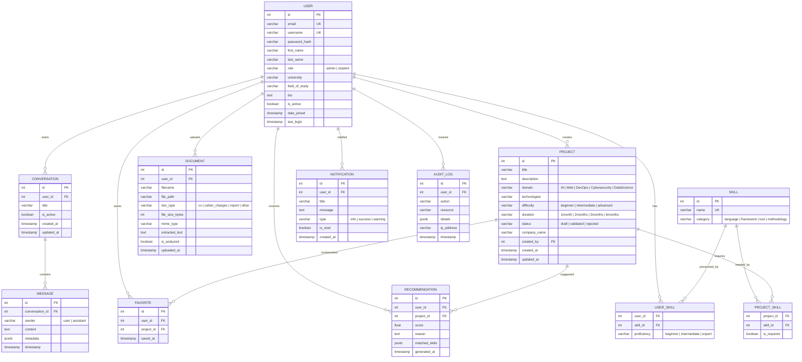

# Smart PFE Platform — Diagramme de Base de Données

## Modèle Entité-Relation (ER Diagram)

## Dictionnaire de Données

### Table USER
| Colonne | Type | Contrainte | Description |
|---------|------|-----------|-------------|
| id | INT | PK, AUTO_INCREMENT | Identifiant unique |
| email | VARCHAR(255) | UNIQUE, NOT NULL | Adresse email |
| username | VARCHAR(150) | UNIQUE, NOT NULL | Nom d'utilisateur |
| password_hash | VARCHAR(255) | NOT NULL | Mot de passe hashé (bcrypt) |
| role | VARCHAR(20) | NOT NULL, DEFAULT 'student' | Rôle (admin/student) |
| university | VARCHAR(255) | NULL | Université |
| field_of_study | VARCHAR(255) | NULL | Domaine d'études |

### Table PROJECT
| Colonne | Type | Contrainte | Description |
|---------|------|-----------|-------------|
| id | INT | PK, AUTO_INCREMENT | Identifiant unique |
| title | VARCHAR(255) | NOT NULL | Titre du projet |
| domain | VARCHAR(100) | NOT NULL | Domaine (IA, Web, DevOps...) |
| difficulty | VARCHAR(20) | NOT NULL | Niveau de difficulté |
| status | VARCHAR(20) | DEFAULT 'draft' | Statut de validation |

### Indexes
- `IDX_user_email` on USER(email)
- `IDX_project_domain` on PROJECT(domain)
- `IDX_project_status` on PROJECT(status)
- `IDX_conversation_user` on CONVERSATION(user_id)
- `IDX_message_conversation` on MESSAGE(conversation_id)
- `IDX_favorite_user_project` on FAVORITE(user_id, project_id) UNIQUE
