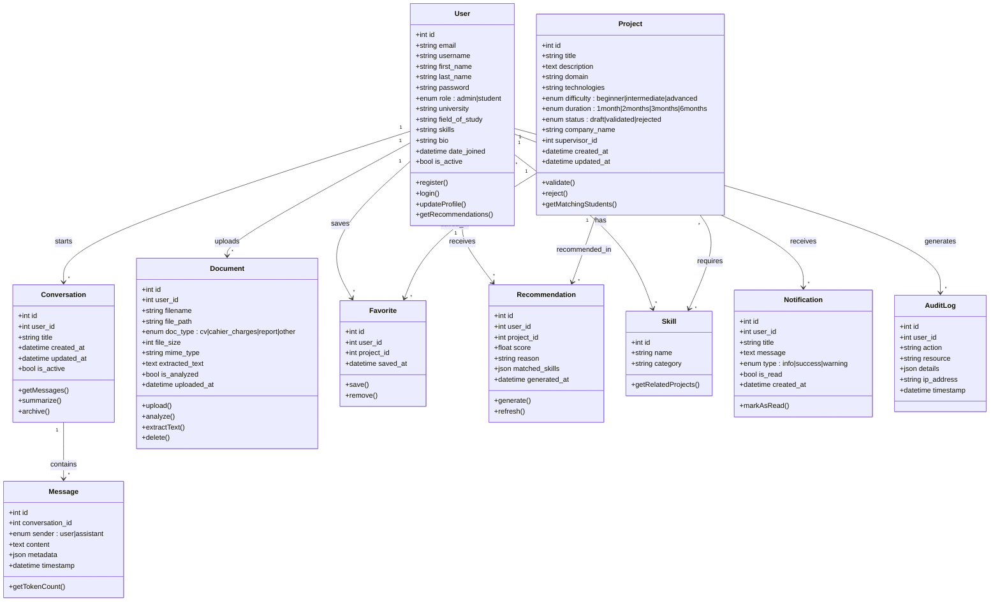

# Smart PFE Platform — Diagramme UML de Classes

## Diagramme de Classes Complet

## Description des Classes

| Classe | Responsabilité |
|--------|---------------|
| **User** | Gestion des utilisateurs (étudiants et admins) avec profil complet |
| **Project** | Projets de PFE/Stage avec domaine, technologies, et statut de validation |
| **Conversation** | Session de chat avec le chatbot IA |
| **Message** | Message individuel dans une conversation (user ou assistant) |
| **Document** | Fichiers uploadés (CV, cahier des charges, rapports) |
| **Favorite** | Liaison entre un utilisateur et ses projets favoris |
| **Recommendation** | Suggestion de projet générée par l'IA avec score de pertinence |
| **Skill** | Compétence technique (langage, framework, outil) |
| **Notification** | Alertes et notifications pour l'utilisateur |
| **AuditLog** | Journal d'audit pour tracer les actions des utilisateurs |
