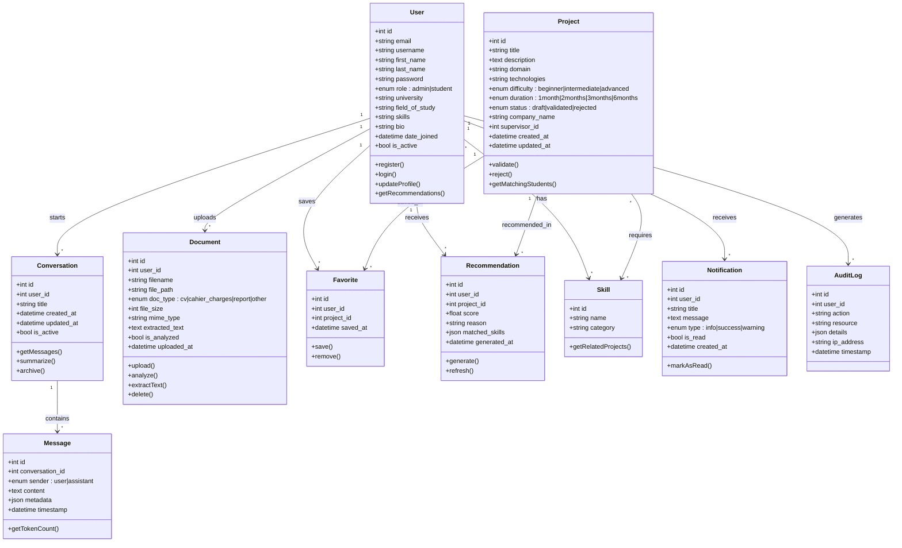
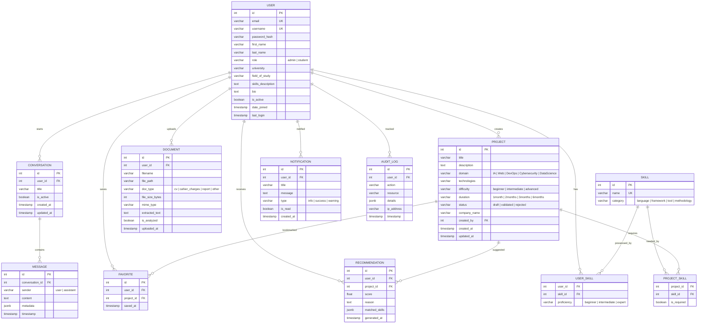
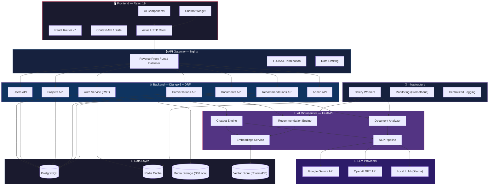
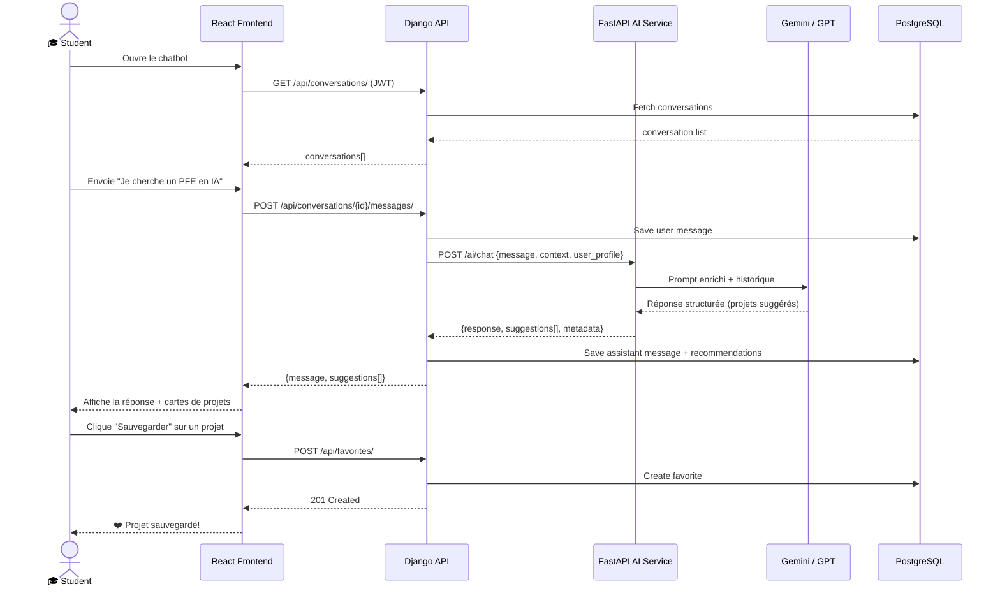
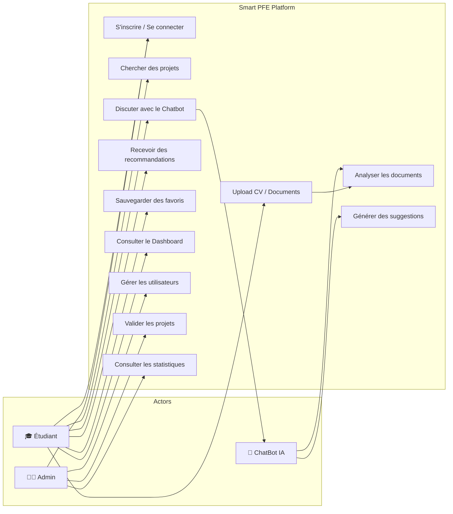

# Smart PFE Platform — Plan d'Implémentation

Plateforme web intelligente pour aider les étudiants à trouver des idées de PFE/Stage en génie logiciel. Stack : **React 19 + Django 6 + DRF + FastAPI (AI) + PostgreSQL**.

---

## 1️⃣ Diagramme UML — Class Diagram Complet

---

## 2️⃣ Diagramme de Base de Données (ER Diagram)

---

## 3️⃣ Architecture Microservices AI — Diagramme Professionnel

---

## 4️⃣ Diagramme de Séquence — Flux Chatbot

---

## 5️⃣ Diagramme de Cas d'Utilisation

---

## Proposed Changes

### Backend Component

#### [MODIFY] [settings.py](file:///c:/Users/hamab/OneDrive/Bureau/smart-pfe-platform/backend/config/settings.py)
Configure for DRF, JWT auth, CORS, PostgreSQL, Celery, and media file storage.

#### [NEW] `backend/accounts/` — Custom user model, JWT auth views, serializers
#### [NEW] `backend/projects/` — Project CRUD, validation, domain filtering
#### [NEW] `backend/conversations/` — Chat sessions, message storage
#### [NEW] `backend/documents/` — File upload, text extraction
#### [NEW] `backend/recommendations/` — Skill matching, scoring engine
#### [NEW] `backend/requirements.txt` — All Python dependencies

---

### Frontend Component

#### [MODIFY] [package.json](file:///c:/Users/hamab/OneDrive/Bureau/smart-pfe-platform/frontend/package.json)
Add react-router-dom, axios, react-markdown, react-icons, chart.js, framer-motion.

#### [NEW] `frontend/src/components/` — Reusable UI components (Navbar, Sidebar, ChatBubble, ProjectCard, FileUpload)
#### [NEW] `frontend/src/pages/` — Login, Register, Dashboard, Chatbot, Admin, Projects, Upload
#### [NEW] `frontend/src/services/` — API client, auth service, chat service
#### [NEW] `frontend/src/context/` — AuthContext, ChatContext
#### [NEW] [frontend/src/index.css](file:///c:/Users/hamab/OneDrive/Bureau/smart-pfe-platform/frontend/src/index.css) — Design system with premium dark theme

---

### AI Service Component

#### [NEW] `ai-service/main.py` — FastAPI app with /chat, /analyze, /recommend endpoints
#### [NEW] `ai-service/requirements.txt` — fastapi, uvicorn, openai, google-generativeai, chromadb
#### [NEW] `ai-service/services/` — chatbot.py, document_analyzer.py, recommendation_engine.py

---

### Documentation

#### [MODIFY] [README.md](file:///c:/Users/hamab/OneDrive/Bureau/smart-pfe-platform/README.md)
#### [MODIFY] [architecture.md](file:///c:/Users/hamab/OneDrive/Bureau/smart-pfe-platform/docs/architecture.md)
#### [NEW] `docs/database_diagram.md` — ER diagram
#### [NEW] `docs/uml_class_diagram.md` — UML class diagram
#### [NEW] `docs/api_specification.md` — REST API endpoints documentation

---

## 6️⃣ Plan de Réalisation — 3 Semaines

### Semaine 1 : Fondations & Backend Core

| Jour | Tâches |
|------|--------|
| **J1–J2** | Setup PostgreSQL, configurer Django settings, custom User model, JWT auth |
| **J3** | App `projects` — modèles, serializers, vues CRUD, filtres |
| **J4** | App `conversations` + `messages` — API pour le chat |
| **J5** | App `documents` — upload, stockage, extraction de texte |

### Semaine 2 : AI Service & Frontend

| Jour | Tâches |
|------|--------|
| **J6** | FastAPI AI service — endpoint chatbot + intégration Gemini |
| **J7** | Document analyzer + recommendation engine |
| **J8–J9** | Frontend — design system, auth pages, routing, protected routes |
| **J10** | Frontend — Dashboard étudiant, chatbot widget interactif |

### Semaine 3 : Intégration & Polish

| Jour | Tâches |
|------|--------|
| **J11** | Frontend — Admin dashboard, upload pages, favorites |
| **J12** | Intégration complète frontend ↔ backend ↔ AI |
| **J13** | Tests end-to-end, correction de bugs |
| **J14** | Documentation finale, déploiement Docker, présentation |

---

## Verification Plan

### Automated Tests
1. **Backend**: `cd backend && python manage.py test` — unit tests for all Django apps
2. **Frontend**: `cd frontend && npm test` — React Testing Library tests
3. **AI Service**: `cd ai-service && pytest` — FastAPI endpoint tests

### Browser Verification
- Navigate to `http://localhost:3000` and verify the login/register flow
- Test chatbot conversation flow
- Verify admin dashboard with user management
- Test file upload and project browsing

### Manual Verification
- Ask the user to review all Mermaid diagrams rendered in the docs
- Verify the architecture diagram matches the implemented microservices
